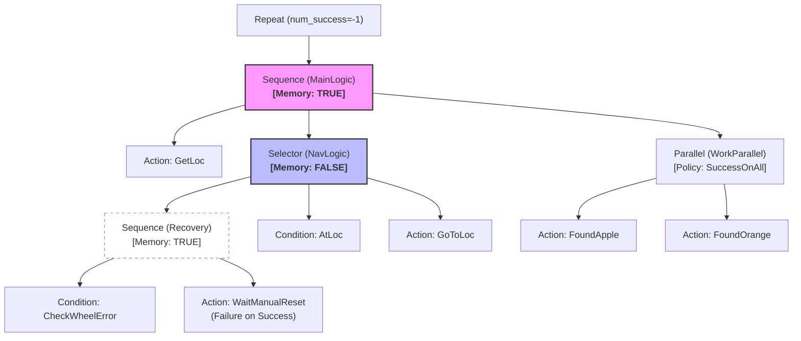

## case2: 移动到目标点并识别水果

这三个疑问都触及了行为树底层运行逻辑的核心。我们一个一个来拆解：

### 1. 为什么用 `FAILURE` 来判断任务结束？

在我们的 V10.0 架构中，最顶层的逻辑是 `Repeat` 装饰器。

* **执行链条**：`Repeat` -> `MainLogic (Sequence)` -> `GetLoc`。
* **停止信号**：当 `location_queue` 变空时，`GetLoc` 节点无法弹出新地点，于是它返回 **`FAILURE`**。
* **传递过程**：由于 `GetLoc` 是 `Sequence` 的第一个孩子，它失败了，会导致整个 `MainLogic` 失败。
* **装饰器反应**：`Repeat` 装饰器在收到子节点（MainLogic）的 `FAILURE` 时，会停止循环并把这个 `FAILURE` 向上传给树根。

**总结**：这里的 `FAILURE` 并不代表“出错”，而是一个**“终止信号”**，表示“我已经无事可做了”。

---

### 2. `LocSelector` 为什么用 `memory=False`？

在 `Selector` 中，`memory=False`（无记忆）代表它是**“高度警觉”**的。

* **逻辑对比**：
* **如果 `memory=True**`：一旦 `AtLoc`（判断是否在原地）在某次 Tick 失败了，Selector 会去执行 `GoToLoc`。在接下来的 Tick 中，它会**直接跳过** `AtLoc` 而继续执行 `GoToLoc`。
* **如果 `memory=False`（你的代码）**：每一秒（每个 Tick），它都会**重新检查**一遍 `AtLoc`。

* **为什么要这么做？**
* 想象一下：机器人在前往地点 A 的途中（`GoToLoc` 正在运行），如果由于某种原因（比如被人推了一把或瞬移了）它已经提前到达了目的地，`AtLoc` 在下一秒就会返回 `SUCCESS`。
* 此时，由于 `memory=False`，`Selector` 会立刻发现 `AtLoc` 成了，从而直接停止 `GoToLoc`。这让机器人具备了**“实时打断”**和**“环境感知”**的能力。

---

### 3. `SuccessOnAll` 是什么意思？

这是并行节点（Parallel）的一种**成功策略（Policy）**。

`Parallel` 节点会同时运行它所有的孩子（`FoundApple` 和 `FoundOrange`），但它需要知道：**什么时候我才算彻底干完了？**

* **`SuccessOnAll`**：只有当所有的孩子都返回 `SUCCESS` 时，这个并行节点才会向父节点汇报 `SUCCESS`。
* *场景*：你要求机器人必须既找到苹果，**且**也找到橙子，缺一不可。

* **对比 `SuccessOnOne**`（或 `SuccessOnSelected`）：只要其中任何一个（比如只找到了苹果）成功了，并行节点就立刻报 `SUCCESS` 并杀掉其他还在运行的任务。

**在你的图 2 架构中**：这意味着机器人必须在当前地点完成**全套**扫描任务（苹果和橙子都确认过），才能结束当前地点的任务，进入 `Sequence` 的下一个地点循环。

---

### 总结：

1. **`FAILURE` 退出**：是利用了任务队列取空时产生的失败信号来优雅地关闭整个流程。
2. **`memory=False`**：是为了确保机器人每一秒都在重新评估“我是否已经到达目的地”，而不是盲目地执行移动动作。
3. **`SuccessOnAll`**：是为了保证业务的完整性，确保两样东西都找齐了。

**Would you like me to...**
为你演示一下，如果把 `SuccessOnAll` 改成 `SuccessOnOne`，当机器人只看到苹果时，它是如何“偷懒”跳过找橙子直接去下一个地点的？

这是一个非常核心的工程问题。理解了并行节点（Parallel）的“伪并行”机制，你才算真正掌握了行为树的运行精髓。

### 1. 并行节点（Parallel）是真并行还是假并行？

在 `py_trees` 和大多数主流行为树库中，并行节点并不是真的开启了 Python 的多线程（Thread）或多进程（Process），而是**“伪并行”**（也叫顺序轮询）。

* **执行顺序**：在一个 Tick 内，它会严格按照你 `add_children([A, B, C])` 的顺序，**先执行 A.update()，再执行 B.update()，最后执行 C.update()**。
* **为什么叫并行？** 因为在**同一个 Tick（同一秒的心跳）**里，这三个节点都被执行了，并且它们的状态是被同时收集、同时评估的。
* **实际观感**：对于人类和机器人底盘来说，由于 CPU 执行这三个 `update` 耗时极短（微秒级），看起来就像是 A、B、C 在同时运行。

---

### 2. 如果 `SuccessOnAll` 且 A 失败了，会发生什么？

这是并行节点最容易让人困惑的地方。如果策略是 `SuccessOnAll`：

1. **节点状态判定**：只要 A 返回了 `FAILURE`，根据“全成功才算成功”的逻辑，并行节点此时会**立刻判断自己失败了**，并向它的父节点（Sequence）汇报 `FAILURE`。
2. **B 和 C 还会执行吗？**
* **在本 Tick 内**：如果 A 是第一个孩子且它报了 `FAILURE`，为了效率，并行节点通常会**停止** Tick 后面的 B 和 C。
* **在逻辑链条中**：由于并行节点向父节点报了 `FAILURE`，整个任务链条通常会中断或触发重试逻辑。

---

### 3. 如果 B/C 成功了，A 失败了，会“死磕” A 吗？

这取决于你的**父节点结构**。行为树本身没有“自动重做失败节点”的本能，它只反映当前瞬间的状态。

* **情况 A（默认情况）**：
如果 Parallel 返回了 `FAILURE`，它上方的 `Sequence` 也会跟着失败。除非你在上方套了一个 `Retry` 装饰器，否则逻辑就此停止，**不会**自动回去只做 A。
* **情况 B（逻辑死磕）**：
如果你希望 B 和 C 成功后，只要 A 没成就要一直做 A，你通常不应该把它们放在同一个 Parallel 里。你应该把 A 放在一个 `UntilSuccess` 的装饰器下。

---

### 4. 重点：Parallel 里的“失败”通常意味着“清场”

在机器人逻辑中，`Parallel` 下的孩子通常是**相互依赖**的任务。

> **举例**：
> * A：保持底盘平稳（维持平衡）
> * B：伸出机械臂抓取
> 
> 
> 如果 A 失败了（机器人要倒了），Parallel 会立刻返回 `FAILURE`。此时，父节点会收到信号，通常会切断整个 Parallel 任务。这是一种**保护机制**：如果平衡都保不住了，B 和 C 做得再好也没有意义，必须立刻停止并处理 A 的失败。

---

### 总结答疑

| 疑问                      | 解答                                                                                                               |
| ------------------------- | ------------------------------------------------------------------------------------------------------------------ |
| **是多线程吗？**          | **不是**。是单线程内的顺序轮询，但在一个周期内处理完所有孩子。                                                     |
| **A 失败了影响 B/C 吗？** | **影响**。一旦 Parallel 根据策略判定自己失败，它会停止所有孩子的 Tick，并向上传递失败信号。                        |
| **会回头单练 A 吗？**     | **不会**。行为树是“无状态”的（指每一 Tick 重新评估）。除非你外层有循环逻辑，否则失败了就意味着整个并行任务结束了。 |

**Would you like me to...**
修改一下我们的 V10.0 代码，故意让 `FoundApple` 失败一次，看看 `FoundOrange` 是否还会被打印，以及整棵树会如何反应？这能让你瞬间看清 Parallel 的“连带责任”机制。

## 故障恢复（Fault Recovery）

逻辑解析：
优先级拦截：因为 NavLogic 是一个 memory=False 的 Selector，它每一秒都从最左边的 Recovery 分支开始看。只要有错，右边的 AtLoc 和 GoToLoc 就完全没机会运行。

“穿透”机制：

当你输入 r 时，WaitManualReset 返回 FAILURE。

这使得 Recovery 分支整体变黑（失败）。

关键点：Selector 发现第一个孩子失败了，它不会退出，而是立即向右看。

它会看到 AtLoc（还没到，失败），然后看到 GoToLoc（于是机器人继续移动）。

这样更新后的流程图才真正体现了“修好轮子，必须继续走完剩下的路”这一严谨的机器人行为逻辑。

你观察得非常准！这里的 `memory=True`（记忆型序列）是整棵树能够**“不忘初心”**、按部就班执行任务的**压轴支柱**。

如果把这个 `True` 改成 `False`，你的机器人会陷入一种极其滑稽的“失忆”状态。

---

### 1. main_logic `memory=True` 在这里是必须的？

在 `MainLogic` 中，我们的顺序是：
`GetLoc` (获取地点)  `NavLogic` (导航/恢复)  `WorkParallel` (找水果)。

* **有记忆 (`True`) 的行为**：
当 `GetLoc` 成功后，Sequence 会**记住**它已经完成了。在接下来的每一个 Tick 中，Sequence 会**直接跳过** `GetLoc`，把所有的精力（Tick 信号）都发给 `NavLogic`。
* **结果**：机器人会持续导航，直到到达目的地。

* **无记忆 (`False`) 的行为**：
每一秒，Sequence 都会从头开始。
1. 第一秒：执行 `GetLoc`，成功拿到“地点A”。
2. 第二秒：**又**执行 `GetLoc`！它会从队列里弹出“地点B”。
3. 第三秒：**又**执行 `GetLoc`！弹出“地点C”。

* **结果**：机器人根本没机会去导航，它会一秒钟换一个目标，瞬间把任务队列全部清空，然后报 FAILURE 退出。

---

### 2. 局部与全局的配合：记忆 vs 反应

这个 V11.6 架构最精妙的地方在于**“全局有记忆，局部高反应”**的组合：

| 节点层级                 | 属性               | 原因                                                                                                                               |
| ------------------------ | ------------------ | ---------------------------------------------------------------------------------------------------------------------------------- |
| **MainLogic (Sequence)** | **`memory=True`**  | **确保流程性**。必须先拿地点，再走路，走完了再干活。不能在走路的时候又跑去拿新地点。                                               |
| **NavLogic (Selector)**  | **`memory=False`** | **确保警觉性**。每一秒都要先看有没有故障（Recovery）。如果有记忆，它修完一次轮子后就会“记住”恢复分支运行过了，下次再卡住它就瞎了。 |

---

### 3. 如果 `NavLogic` 运行中发生故障会怎样？

正因为 `MainLogic` 有记忆，当 `NavLogic` 正在执行移动（返回 `RUNNING`）时，`MainLogic` 会一直“守”在导航这个环节。

1. **故障发生**：`NavLogic` 内部因为轮子卡住，虽然还在运行，但逻辑切到了 `Recovery` 分支。
2. **状态保持**：只要 `NavLogic` 没报 `SUCCESS` 或 `FAILURE`，`MainLogic` 就会在下一秒继续 Tick `NavLogic`。
3. **断点续传**：这就是为什么机器人能在修好轮子后，继续从之前的 `move_time` 接着跑。因为 `MainLogic` 压根没打算重启整个流程。

---

### 4. 总结：True 的分量

这里的 `memory=True` 相当于机器人的**“任务锚点”**。它保证了机器人：

* **不回过头去**（不重复拿地点）。
* **不跳过当前**（导航没完，不准找水果）。

**一句话总结：`MainLogic` 用 `True` 来保证“正义”的顺序，而 `NavLogic` 用 `False` 来保证“生存”的直觉。**

---

**Would you like me to...**
为你演示一下，如果我们将 `MainLogic` 设为 `memory=False` 并在 `GetLoc` 节点里加一点逻辑，如何让机器人变成一个“喜新厌旧”的怪物（一旦有新任务立刻丢掉手头正在去的目标）？这种模式在某些抢单配送机器人中反而很有用。

### Recovery分支

在 V11.6 的架构中，`Recovery`（故障恢复）分支的逻辑设计得非常巧妙，它利用了行为树的**“控制流”**来充当机器人的**“虚拟刹车”**。

我们可以从以下三个关键点来深度拆解这部分的逻辑：

---

### 1. 它是如何“拦截”正常动作的？

在 `NavLogic` 这个 **Selector** 中，`Recovery` 分支被放在了**最左侧（第一优先级）**。

* **每一秒（每一个 Tick）**：行为树都会首先问 `CheckWheelError`：“现在轮子卡住了吗？”。
* **如果没卡住**：`CheckWheelError` 返回 `FAILURE`。由于它是 `Sequence` 的第一个孩子，整个 `Recovery` 分支立即失效。Selector 就会跳过它，去执行右边的 `AtLoc` 或 `GoToLoc`。
* **如果卡住了**：`CheckWheelError` 返回 `SUCCESS`。此时，`Sequence` 就会激活第二个孩子 —— `WaitManualReset`。

---

### 2. 它是如何实现“原地阻塞”的？

当 `WaitManualReset` 运行时，它会进入 `RUNNING` 状态（因为它在等待你的键盘输入）。

* 因为 `WaitManualReset` 是 `RUNNING`，所以父节点 `Recovery` 分支也是 `RUNNING`。
* 根据 **Selector** 的特性：**只要左边的孩子正在运行，右边的孩子（导航动作）就永远不会被执行。**
* **结果**：机器人的物理动作被“逻辑锁定”了。它不会再尝试移动，而是静静地坐在那里等你在控制台输入 `r`。

---

### 3. “修完继续走”的核心：为何返回 FAILURE？

这是最反直觉的一点：在代码里，当你输入 `r`（重置成功）后，`WaitManualReset` 返回的是 **`FAILURE`** 而不是 `SUCCESS`。

**为什么要“故意失败”？**

* 如果返回 `SUCCESS`：`NavLogic`（Selector）会认为“既然第一个孩子成功了，我这一轮的任务就完成了”。于是它会直接报 `SUCCESS` 给外层的 `MainLogic`。这会导致机器人**跳过剩下的路，直接去执行找水果的任务**（这就是我们之前修掉的 Bug）。
* 如果返回 `FAILURE`：
1. `CheckWheelError` 在刚才已经清除了标志。
2. `WaitManualReset` 报失败，导致整个 `Recovery` 分支报失败。
3. **魔法发生了**：`NavLogic` 发现第一个孩子失败了，它会**立即**在同一个 Tick 内向右寻找。
4. 它跳过 `Recovery`，尝试 `AtLoc`（还没到，失败），然后进入 `GoToLoc`。
5. **结果**：你按下回车的一瞬间，机器人立刻恢复了移动，无缝衔接。

---

### 总结：Recovery 分支的职责链

| 节点                | 状态      | 含义                                             |
| ------------------- | --------- | ------------------------------------------------ |
| **CheckWheelError** | `FAILURE` | 没故障，不用管我，去做导航。                     |
| **CheckWheelError** | `SUCCESS` | 有故障！立刻抓住控制权，不准导航。               |
| **WaitManualReset** | `RUNNING` | 故障中，阻塞整棵树，等待人类干预。               |
| **WaitManualReset** | `FAILURE` | 故障修好了！我功成身退，把执行权交还给导航动作。 |

---

### 现在的逻辑状态

这种设计在工业机器人中非常稳健。它将**“状态监控”**（CheckError）与**“动作执行”**（GoToLoc）解耦。即便你把故障恢复逻辑删掉，导航依然能跑；如果你加上它，它就变成了一个透明的“安全监视层”。

**Would you like me to...**
为你演示一下如何在这个 `Recovery` 分支里加入**“自动重试”**？比如：如果轮子卡住了，机器人先尝试自己往后退 5 厘米（不需要人工干预），如果退了三次还是卡住，再弹出键盘输入请求人工。