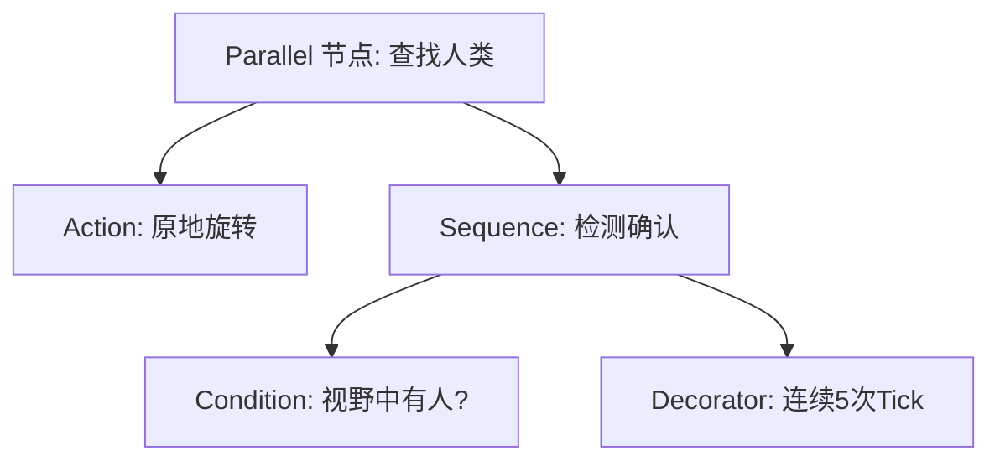
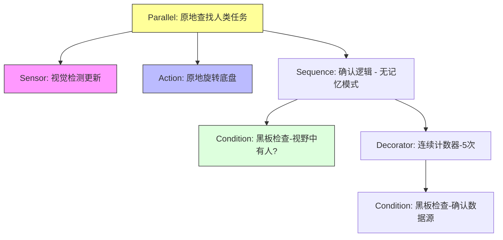

- [Introduction to behavior trees](https://robohub.org/introduction-to-behavior-trees/)

## Note

1. FallBack：只要一个达到条件就行

一般用于查询后执行：
- One very common design principle you should know is defined in the book as **explicit success conditions**. In simpler terms, you should almost always check before you act. For example, if you’re already at a specific location, why not check if you’re already there before starting a navigation action?

   (到达A或者没到A的话就GoToA)

- We can also use Fallback nodes to define reactive behaviors; that is, if one behavior does not work, try the next one, and so on.

2. Parallel nodes allows multiple actions and/or conditions to be considered within a single tick
  
  并行节点可以同时获取几个 multiple actions and/or conditions，然后自己对这些状态进行or and运算

3. 原地旋转，直到连续 5 次 tick 都检测到人为止

4. 节点返回状态

我们要先理清一个核心概念：在行为树中，任何一个节点在被 Tick（执行）之后，必须返回且只能返回以下三种状态之一：

SUCCESS（成功）

FAILURE（失败）

RUNNING（运行中）

