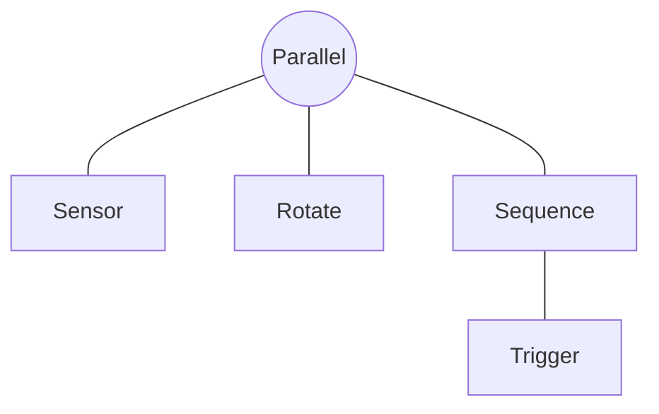
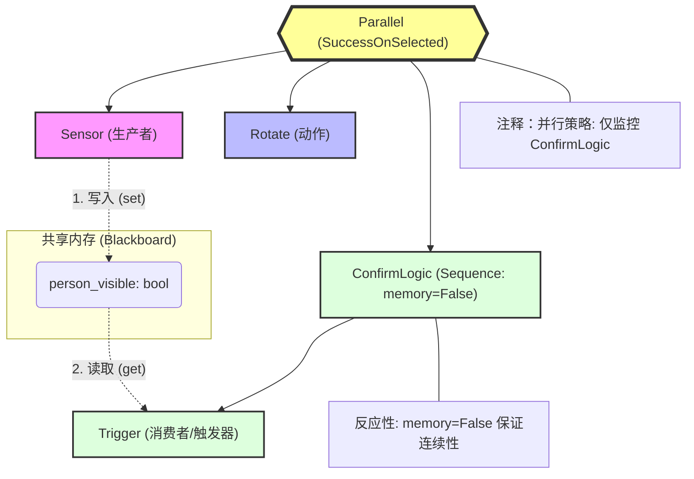
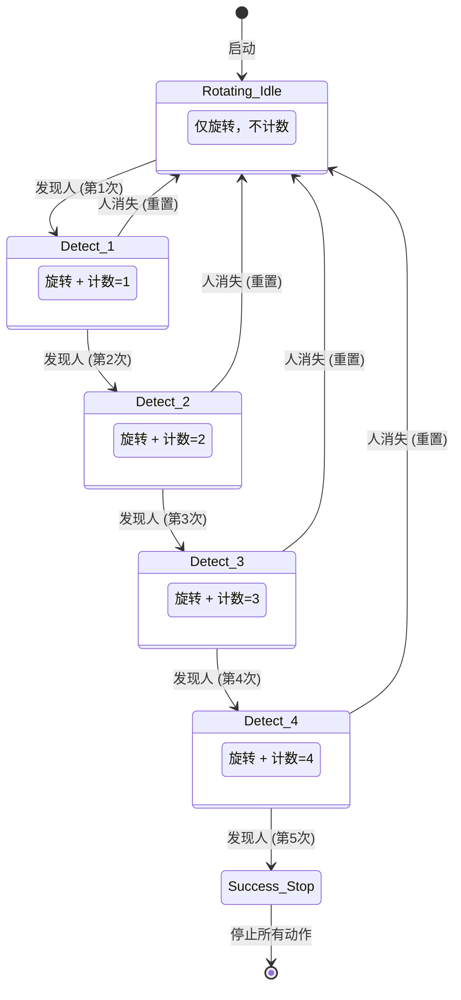

- [Introduction to behavior trees](https://robohub.org/introduction-to-behavior-trees/)

## Note

1. FallBack：只要一个达到条件就行

一般用于查询后执行：
- One very common design principle you should know is defined in the book as **explicit success conditions**. In simpler terms, you should almost always check before you act. For example, if you’re already at a specific location, why not check if you’re already there before starting a navigation action?

   (到达A或者没到A的话就GoToA)

- We can also use Fallback nodes to define reactive behaviors; that is, if one behavior does not work, try the next one, and so on.

2. Parallel nodes allows multiple actions and/or conditions to be considered within a single tick
  
  并行节点可以同时获取几个 multiple actions and/or conditions，然后自己对这些状态进行or and运算

### 原地旋转，直到连续 5 次 tick 都检测到人为止

我们要先理清一个核心概念：在行为树中，任何一个节点在被 Tick（执行）之后，必须返回且只能返回以下三种状态之一：

SUCCESS（成功）
FAILURE（失败）
RUNNING（运行中）

`rotate_until_bt.py`

fsm版本

`rotate_until_fsm.py`

看了这段代码，你应该能明显感觉到它和 BT 版本的巨大区别：

状态爆炸（State Explosion）：为了数 5 个数，我不得不手动写了 DETECT_1 到 DETECT_4 四个状态。如果你要求连续检测 100 次，这个 if-elif 逻辑将变成几百行，根本无法维护。

逻辑重复：在每个状态里，我都得判断 if person_visible ... else ... self.STATE_IDLE_ROTATING。这种“如果失败就回退到初始状态”的逻辑在 FSM 里需要每一行都写，而在 BT 里只需要一个 memory=False 的 Sequence 就能自动搞定。

动作与逻辑耦合：在 FSM 里，我必须在 tick 函数里显式调用 execute_rotate()。如果以后我想把“旋转”改成“原地跳舞”，我得修改状态机内部的所有逻辑。而在 BT 里，你只需要把 Rotate 节点换成 Dance 节点，不需要动任何逻辑代码。

总结： FSM 在处理简单的、无回退的顺序流程时很好用；但在处理这种**带有计数确认、需要随时反应环境变化（Reactiveness）**的机器人任务时，BT 的优势是压倒性的。

- 总结

FSM 是“跳转驱动”的：它的核心是“如果发生 A，就切换到状态 B”。在处理简单的顺序流程时很清晰，但在处理“边做 A 边看 B”且带有“计数确认”这种复合逻辑时，会变得非常臃肿。

BT 是“决策驱动”的：它的核心是“每一秒我都重新评估所有可能性”。正如我们在 V7.0 代码中看到的，Trigger 节点每一秒都在确认计数，而 Parallel 节点每一秒都在确认任务是否完成。
