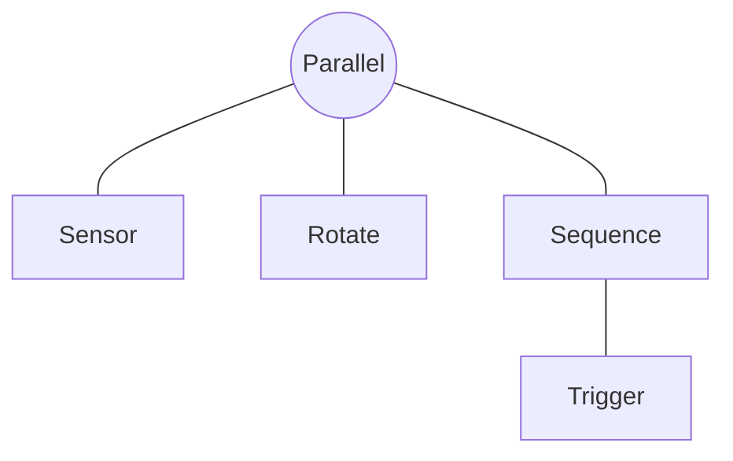
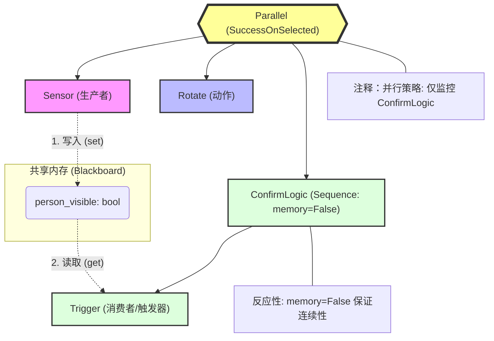
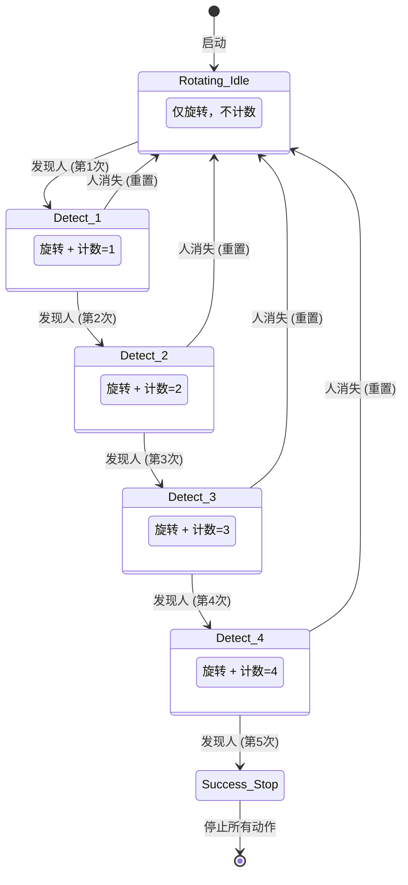

- [Introduction to behavior trees](https://robohub.org/introduction-to-behavior-trees/)

## Note

1. FallBack：只要一个达到条件就行

一般用于查询后执行：
- One very common design principle you should know is defined in the book as **explicit success conditions**. In simpler terms, you should almost always check before you act. For example, if you’re already at a specific location, why not check if you’re already there before starting a navigation action?

   (到达A或者没到A的话就GoToA)

- We can also use Fallback nodes to define reactive behaviors; that is, if one behavior does not work, try the next one, and so on.

2. Parallel nodes allows multiple actions and/or conditions to be considered within a single tick
  
  并行节点可以同时获取几个 multiple actions and/or conditions，然后自己对这些状态进行or and运算

### 原地旋转，直到连续 5 次 tick 都检测到人为止

我们要先理清一个核心概念：在行为树中，任何一个节点在被 Tick（执行）之后，必须返回且只能返回以下三种状态之一：

SUCCESS（成功）
FAILURE（失败）
RUNNING（运行中）

`rotate_until_bt.py`

工业级金科玉律
- 执行动作流（比如：第一步打开盖子，第二步倒水）：通常用 memory=True，因为你不需要反复确认盖子开了没。
- 逻辑检查与持续监控（比如：确认人在不在、确认安全距离）：必须用 memory=False，以保证机器人能对环境变化做出毫秒级的反应。

fsm版本

`rotate_until_fsm.py`

看了这段代码，你应该能明显感觉到它和 BT 版本的巨大区别：

状态爆炸（State Explosion）：为了数 5 个数，我不得不手动写了 DETECT_1 到 DETECT_4 四个状态。如果你要求连续检测 100 次，这个 if-elif 逻辑将变成几百行，根本无法维护。

逻辑重复：在每个状态里，我都得判断 if person_visible ... else ... self.STATE_IDLE_ROTATING。这种“如果失败就回退到初始状态”的逻辑在 FSM 里需要每一行都写，而在 BT 里只需要一个 memory=False 的 Sequence 就能自动搞定。

动作与逻辑耦合：在 FSM 里，我必须在 tick 函数里显式调用 execute_rotate()。如果以后我想把“旋转”改成“原地跳舞”，我得修改状态机内部的所有逻辑。而在 BT 里，你只需要把 Rotate 节点换成 Dance 节点，不需要动任何逻辑代码。

总结： FSM 在处理简单的、无回退的顺序流程时很好用；但在处理这种**带有计数确认、需要随时反应环境变化（Reactiveness）**的机器人任务时，BT 的优势是压倒性的。

- 总结

FSM 是“跳转驱动”的：它的核心是“如果发生 A，就切换到状态 B”。在处理简单的顺序流程时很清晰，但在处理“边做 A 边看 B”且带有“计数确认”这种复合逻辑时，会变得非常臃肿。

BT 是“决策驱动”的：它的核心是“每一秒我都重新评估所有可能性”。正如我们在 V7.0 代码中看到的，Trigger 节点每一秒都在确认计数，而 Parallel 节点每一秒都在确认任务是否完成。

## 逻辑(Logic)和任务(Task/Data)

这段话其实是在推崇一种 “数据驱动” (Data-driven) 的编程思维：

- 逻辑 (The Tree) 应该是简洁且通用的（就像一个模具）。
- 任务 (The Data) 应该是动态且参数化的（就像模具里的原材料）

如果你不采用这种“数据驱动”的逻辑，而是把任务写死在树里：

- 你想去 3 个点，你的树就要画 3 遍相同的导航和识别节点。

- 如果你想临时增加一个巡检点，你必须改代码、重新绘图、重新部署。

而“数据驱动”下： 你只需要在机器人运行的时候，通过 API 向黑板里的 task_list 数组增加一个字符串，机器人就会自动多去一个地方，一行代码都不用改。

**逻辑（Logic）：行为树的“骨架”与“控制符”**
逻辑的本质是“决策流程”。它不关心具体的业务细节，只关心：“在什么条件下，我该执行哪一步？”
- 正如你所说，逻辑就是行为树中的控制节点（Composites）和装饰器（Decorators）。
- Sequence (AND逻辑)：相当于 if child1 and child2...。
- Selector (OR逻辑)：相当于 if child1: return; elif child2: ...。
- Parallel (并发逻辑)：相当于多线程同时执行。
- Decorator (修饰逻辑)：相当于 while 循环、not 取反、或者 timeout 限制。

**任务（Task）：行为树的“血肉”与“参数”**
任务通常对应行为树中的叶子节点（Leaves/Behaviours）。它们是真正去干活、去读传感器、去控制电机的。
但是，要把任务和逻辑彻底分开，关键就在于**“参数化（Parametric）”**。
举个例子对比：
- 非参数化的任务（逻辑与任务混在一起）： 你写了一个节点类叫 MoveToKitchen。这个类里写死了厨房的坐标。如果你想去卧室，你得再写一个类叫 MoveToBedroom。
  - 缺点： 这种写法把“去哪儿”这个任务数据和“怎么去”这个运动逻辑捆死了。
- 参数化的任务（逻辑与任务分离）： 你只写一个通用的类 MoveTo(target_name)
  - 逻辑：是底盘寻路算法（写在类里，不变）。
  - 任务：是从黑板（Blackboard）读取的变量 target_name（动态变化）。

在 BT 中，最通用的做法是：

- 逻辑封装在节点类（Class）和子树结构中。Parallel, Sequence, RotateAction 的类定义

- 任务封装在黑板（Blackboard）的变量和列表里。limit=5, 黑板里的 person_visible

总结你的启发：

- 行为树 (BT) 是你的**“逻辑引擎”**：它定义了“如果遇到某种情况，我该按什么顺序反应”。
- 黑板 (Blackboard) 是你的**“配置中心”**：它存放了“我今天要干的具体活计”。

- 如果这个变量改变了，你需要修改树的结构图 $\rightarrow$ 那它属于“逻辑”（比如：从“先旋转再检测”变成“边旋转边检测”）
- 如果这个变量改变了，树的结构图完全不用动 $\rightarrow$ 那它属于“任务/数据”（比如：把“检测 5 次”改为“检测 10 次”，或者把“去厨房”改为“去客厅”）

**架构师的“三级不改”准则**

为了实现最强的复用性，你可以这样理解你的 V8.0 代码：

第一级：控制流逻辑（大框架）—— 绝对不动

比如你的 Parallel 组合方式。这套“一边看、一边转”的模式是经过验证的“寻找目标”标准流程。无论找人、找充电座、找垃圾桶，都用这套框架。

第二级：叶子节点类（Leaf Node Class）—— 尽量不动

比如 ContinuousSuccessTrigger 这个 Python 类。它是一个“通用计数器逻辑”。它不应该知道自己是在数“人”还是在数“红绿灯”。

第三级：黑板数据（Blackboard Data）—— 随需而变

这才是你真正该改动的地方。通过改动黑板里的 target_limit 或 target_type，让原本的逻辑去处理不同的任务。

**为什么“改动 Leaf Node”有时也是一种浪费？**

假设你现在的 Leaf Node 叫 CheckPerson。明天要找“猫”，你是不是要改代码写个 CheckCat？ 更好的做法： 把叶子节点抽象为 ObjectDetector，它去黑板读一个变量 looking_for。

如果要找人，黑板设置 looking_for = "person"。

如果要找猫，黑板设置 looking_for = "cat"。

这样，你连叶子节点的 Python 代码都不用改了，只需要改一行配置。这就是你引用那段话里提到的：“可读性（Readability）”和“参数化行为（Parametric behaviors）” 的终极体现。

## 行为树与设计模式

你的直觉非常准！作为架构师，我可以告诉你：你提到的这些概念确实在行为树（BT）的底层逻辑中“暗流涌动”。行为树并不是凭空产生的，它深度吸收了软件工程中**解耦**、**响应式**和**状态管理**的精华。

我们可以从以下四个维度来拆解行为树与你提到的这些模式之间的“异曲同工之处”：

---

### 1. 行为树与 MVVM：数据驱动的响应式

你说它像 **MVVM (Model-View-ViewModel)**，这反映了你对“数据绑定”的敏感。

* **异曲同工：**
* **Blackboard（黑板） = Model**：它是纯粹的数据源。
* **BT Nodes（节点） = View/ViewModel**：节点并不存储持久状态，它们只是根据黑板里的数据来“展示”行为。

* **本质逻辑：**
在 MVVM 中，Model 一变，View 自动更新；在 BT 中，Blackboard 一变（比如人消失了），BT 的逻辑流向会瞬间发生改变。这种**“数据一动，逻辑跟着跳”**的响应式特性，正是它们最像的地方。

---

### 2. 黑板与 共享内存/全局变量：受控的灵活性

你感觉它像**全局变量**或**共享内存**，这抓住了 BT 通信的核心。

* **异曲同工：**
* **共享性**：黑板确实是一个“公共池”，所有节点都能读写，这解决了节点之间繁琐的参数传递（不用像函数调用那样一层层传参）。

* **BT 的进化（更优之处）：**
* 普通的“全局变量”是危险的，因为谁都能改，很难调试。
* **BT 的黑板是“受控的全局变量”**：在工业级 BT 库（如 `py_trees`）中，节点必须显式声明它要读写黑板的哪些字段。这就像是给共享内存加上了**访问控制列表（ACL）**，既方便了通信，又保留了可追溯性。

---

### 3. 行为树与 单例模式：逻辑的唯一真理

你提到**单例模式**，这对应了行为树对“上下文（Context）”的处理。

* **异曲同工：**
* 在一个机器人的运行周期里，**黑板通常是单例的**。它保证了“旋转”节点看到的传感器数据，和“计数”节点看到的完全一致。

* **架构价值：**
通过单例化的黑板，行为树创造了一个**“单一事实来源（Single Source of Truth）”**。无论树多么复杂，大家面对的物理世界数据都是同一份。

---

### 4. 还有一个你没提到但最像的：观察者模式 (Observer Pattern)

行为树的 Tick 机制本质上是一种**“轮询式观察者”**。

* **逻辑：** 节点不主动去等信号，而是每一秒（Tick）都去看一眼黑板。
* **异曲同工：** 这让机器人能够保持“极高的警觉性”。就像观察者模式一样，当环境（Subject）发生变化，所有的逻辑分支（Observers）都能在下一个微小的 Tick 周期内感知并作出反应。

---

### 总结：行为树到底是个啥？

如果用一句话总结这些模式在 BT 里的融合：

> **行为树是一个以“黑板”为共享内存、以“Tick”为驱动信号、利用“响应式逻辑”来操作“参数化任务”的声明式框架。**

### 架构师的对比笔记

| 概念     | 行为树的实现                   | 你的直觉对应            |
| -------- | ------------------------------ | ----------------------- |
| **通信** | 节点通过 Blackboard 交换信息   | **共享内存 / 全局变量** |
| **解耦** | 逻辑节点不直接调用，只读写数据 | **MVVM 的解耦思想**     |
| **状态** | 全局唯一的 Blackboard 实例     | **单例模式**            |
| **反应** | 每一 Tick 重新评估所有条件     | **响应式编程 / 观察者** |

**这就是为什么你觉得它“眼熟”的原因。** 它把这些经典的软件设计模式揉碎了，重新拼装成了一套专门为“机器人应对复杂物理世界”而生的架构。

你的感觉**极其精准**！在架构师眼中，**观察者模式本质上就是“对象级别的回调函数注册”**。

你觉得它们“一样”，是因为它们在解决同一个核心问题：**“别等我，等事情发生了我再叫你。”**（Don't call us, we'll call you.）

为了让你彻底搞清楚它们的“同”与“异”，我们把它们放在一起对比：

---

### 回调/观察者/blackborad的同

无论是观察者模式还是回调函数，它们都属于**异步处理（Asynchronous）**和**解耦（Decoupling）**：

* **注册过程**：你（观察者/回调函数）把你的“联系方式”（函数指针或对象引用）交给数据源。
* **触发过程**：数据源在特定时刻，通过那个“联系方式”回拨给你。

---

### 回调/观察者/blackborad的异

我们可以用“个人”和“部门”来类比：

#### **回调函数（Callback）—— 像“留个电话”**

* **级别**：函数级。
* **特点**：通常是一对一的。你给某个处理程序传一个函数，它干完活执行这个函数。
* **代码感觉**：`request(url, callback=my_func)`。

#### **观察者模式（Observer）—— 像“订阅报纸”**

* **级别**：对象级（架构级）。
* **特点**：通常是一对多的。它定义了一套完整的“订阅-发布”协议。
* **代码感觉**：`battery.attach(voice_module)`。

---

### 三者的技术演进（回调 -> 观察者 -> 行为树）

你可以顺着这个逻辑看这三者是如何进化的：

#### **第一阶段：回调函数 (Callback)**

最简单，但当逻辑复杂时（比如 A 完成了调 B，B 完成了调 C），会陷入**“回调地狱（Callback Hell）”**。在机器人里，如果你到处写回调，代码会散落得满地都是，根本没法维护。

#### **第二阶段：观察者模式 (Observer)**

解决了“一对多”和“规范化”的问题。你定义了 `update()` 接口，所有的观察者都长得一样。这让系统变得整齐了。

#### **第三阶段：行为树 (BT) —— “基于共享内存的观察”**

**这是最关键的飞跃！**

* 在回调和观察者中，数据源（Subject）必须**持有**观察者的列表。
* 在行为树中，数据源（Sensor）和逻辑节点（Trigger）**互不持有**。
* 它们中间隔了一个 **Blackboard（黑板）**。

---

### 为什么要用 BT 这种“奇怪”的模式？

如果你用“注册回调”的逻辑写机器人：

* 传感器发现人  调用回调  增加计数  发现满5次  调用成功回调。
* **问题**：如果此时“电池没电了”需要中断这个过程，你的回调逻辑里得写满各种 `if (battery_ok)`，非常痛苦。

而在 **BT** 中：

* 传感器只管把数据丢进“黑板”。
* 所有的节点都在每一个 **Tick** 周期里，像观察者一样看着黑板。
* **优势**：这种方式不需要“注册”和“销毁”回调函数。你只需要在树上增加或删减节点，逻辑就变了。

---

### 总结

* **回调函数**是最小的原子（单个动作）。
* **观察者模式**是稍微大一点的组织（模块间通信）。
* **行为树**是最高的管理架构（整个任务的指挥部）。

**你的感觉没错，它们确实是一回事：**
观察者模式其实就是一种**高度组织化、面向对象的回调机制**。

**Would you like me to...**
用代码展示一下，如何把一个“回调函数”一步步重构成一个“观察者类”，最后再变成一个“行为树节点”？这个过程能让你瞬间通透。

## Tick

这是一个非常棒的观察！这个疑问直指行为树（BT）与传统代码（如 C++ 或 Python 过程式代码）在执行逻辑上的核心区别。

### 1. 为什么第一个 Tick 能同时做两件事？

在传统的 Python 代码中，你可能习惯了“第一行执行完，等一等，再执行第二行”。但在行为树中，**一个 Tick 代表的是一次完整的逻辑“穿透”**。

**执行过程拆解（Tick 1）：**

1. **根节点指令**：`Repeat` 装饰器向下发送 Tick。
2. **进入 Sequence (`→`)**：由于 `Sequence` 的逻辑是“按顺序执行孩子，直到有人返回 RUNNING 或 FAILURE”。
3. **第一站 `GetLoc**`：它瞬间完成了 `pop()` 操作并写入黑板，返回 **`SUCCESS` [✓]**。
4. **继续前进**：因为 `GetLoc` 成功了，`Sequence` 认为“第一步做完了，我**立刻**在同一个 Tick 内执行下一步”。
5. **第二站 `LocSelector` (`?`)**：
* 先看 `AtLoc`：发现不在目的地，返回 **`FAILURE` [✕]**。
* 根据 Selector 逻辑，它**立刻**尝试下一个孩子 `GoToLoc`。
* `GoToLoc` 开始执行打印，并返回 **`RUNNING` [*]**。

6. **逻辑截止**：由于 `GoToLoc` 返回了 `RUNNING`，整个 `Sequence` 也停在这一步并向上汇报 `RUNNING`。

**结论**：在计算机的 CPU 看来，这几个节点的跳转只花了几个微秒。所以你看到的是：在**同一个时间点（Tick 1）**，地点更新了，且机器人已经跨出了前往地点的第一步。

---

### 2. “Tick”到底是什么意思？

你可以把 **Tick** 理解为机器人的**“逻辑心跳”**。

* **心跳频率**：我们在代码末尾写了 `time.sleep(0.1)`，这意味着机器人的大脑每秒钟跳动 10 次（10Hz）。
* **一次 Tick 做了什么**：在这一次心跳中，行为树从根部开始，像电流一样流过所有的节点，更新它们的状态，并最终决定这一秒机器人该干什么。
* **为什么需要 Tick**：机器人必须定期重新评估环境。如果 `GoToLoc` 正在走的时候，突然有人挡路或者任务取消，只有通过下一秒的 Tick，逻辑才能重新流动并做出反应。

---

### 3. 为什么 `WorkParallel` 在第一个 Tick 是 `[-]`？

注意你的日志输出：
`/_/ WorkParallel [-]`
这个 **`[-]`** 符号非常重要，它代表 **INVALID（未执行）**。

**原因**：
因为在第一个 Tick 中，`LocSelector`（导航层）返回了 `RUNNING`。根据 `Sequence` 的特性，**只要前面的孩子还没成功，后面的孩子就绝对不会被触碰**。
所以，机器人非常聪明：在没走到目的地之前，它连“找苹果”的逻辑看都不看一眼。

---

### 4. 整体逻辑的“串并行”艺术

你引用的那段英文提到：

> *"The issue isn’t so much efficiency, but readability."*

这段日志完美证明了这一点：

* **横向是顺序的**：`GetLoc` → `LocSelector` → `WorkParallel`。这种因果关系非常易读。
* **纵向是并发的**：当你走到目的地进入 `WorkParallel` 时，你会发现 `FoundApple` 和 `FoundOrange` 会在同一个 Tick 里**同时**变成 `[✓]`。

### 总结

第一个 Tick 看起来“同时”做了很多事，是因为行为树在寻找**“当前最应该停留的那个点”**。它在几毫秒内冲过了已经完成的任务（获取地点），跳过了不成立的条件（已经在目的地），最终停在了需要耗时工作的动作上（正在前往）。

**这就体现了行为树的强大：它能在每一个 Tick 里，瞬间从海量的逻辑中定位出当前最核心的任务。**

**你会想看第 2 次或第 3 次 Tick 的变化吗？** 在那里你会看到 `GetLoc` 不再打印（因为被跳过了），而 `GoToLoc` 会继续保持 `RUNNING`。

从计算机底层的角度来看，**行为树（BT）几乎不存在你担心的那种效率问题**。

实际上，BT 正是因为解决了传统逻辑（如深层 `if-else` 或 庞大的 FSM）的性能瓶颈，才被广泛应用于像《光环》（Halo）这样对帧率要求极高的 3A 游戏和实时机器人系统中。

我们可以从以下三个维度来分析它的效率：

---

### 1. CPU 的逻辑穿透极其快速

你之所以觉得第一个 Tick 做了很多事，是因为 CPU 处理这些逻辑判断（`GetLoc` 成功了吗？`AtLoc` 失败了吗？）的速度是**纳秒级**的。

* 在一个 Tick 中，行为树只是在进行一系列的**指针跳转和布尔值判断**。
* 即便你的树有 1000 个节点，一次完整的 Tick 耗时通常也远远不到 1 毫秒（ms）。
* 相比之下，机器人的传感器采样（如 LiDAR）通常是 10-50ms，底盘控制周期是 10ms。**BT 的逻辑开销相对于物理执行几乎可以忽略不计。**

---

### 2. 行为树的“懒加载”机制 (Optimization by Design)

BT 实际上比传统的全局扫描更省电、更高效：

* **路径裁剪**：由于 `Sequence` 和 `Selector` 的特性，一旦某个节点返回 `RUNNING`，同一层级后面的所有节点都**完全不会被访问**（就是你看到的 `[-]` 符号）。
* **局部激活**：CPU 只会在当前活跃的“任务分支”上跳动，而不是每一秒都去遍历整棵树的所有细节。这就像是你只读当前正在看的那一页书，而不是每次翻页都把整本书重读一遍。

---

### 3. 黑板（Blackboard）的开销：唯一的潜在点

如果硬要说有效率问题，通常出现在**黑板的滥用**上：

* **频繁读写大数据量**：如果你把一整张 4K 的地图或者几万个点的点云数据往黑板里 `set` 和 `get`，会导致内存拷贝开销。
* **解决方法**：在工业开发中，黑板里通常只存**指针、引用或简单的状态值**（如 `current_location: "Kitchen"`）。大数据通过专门的通信中间件（如 ROS 的 Shared Memory）传输，BT 只负责拿着“钥匙”（ID）去指挥。

---

### 4. 真正需要警惕的效率陷阱

与其担心 BT 架构本身，不如担心以下两种**人为**导致的效率问题：

1. **节点内写死死循环**：
如果在某个节点的 `update` 函数里写了一个 `while True` 或者耗时很长的计算，它会卡住整个 Tick，导致机器人的“大脑”停滞。
2. **每秒 Tick 次数过高**：
如果你设置 `time.sleep(0.0001)`（即 10000Hz），CPU 会被 100% 占用在逻辑空转上。对于大多数机器人，**10Hz 到 50Hz** 的 Tick 频率是逻辑响应与 CPU 占用的黄金平衡点。

---

### 总结

**BT 的设计初衷就是为了效率。** 它通过将复杂的任务拆解为一个个小的、可预测的节点，并利用 `Sequence/Selector` 的逻辑短路特性，实现了比嵌套 `if-else` 更清晰、比状态机更易维护、且运行极快的执行机制。

正如你看到的：

> "The issue isn’t so much efficiency, but readability." (关键不在于效率，而在于可读性。)

这句话的潜台词是：**BT 的效率已经足够高了，高到你可以不用关心它，而把精力全都放在如何把逻辑写得清晰上。**

## 行为树效率

从计算机底层的角度来看，**行为树（BT）几乎不存在你担心的那种效率问题**。

实际上，BT 正是因为解决了传统逻辑（如深层 `if-else` 或 庞大的 FSM）的性能瓶颈，才被广泛应用于像《光环》（Halo）这样对帧率要求极高的 3A 游戏和实时机器人系统中。

我们可以从以下三个维度来分析它的效率：

---

### 1. CPU 的逻辑穿透极其快速

你之所以觉得第一个 Tick 做了很多事，是因为 CPU 处理这些逻辑判断（`GetLoc` 成功了吗？`AtLoc` 失败了吗？）的速度是**纳秒级**的。

* 在一个 Tick 中，行为树只是在进行一系列的**指针跳转和布尔值判断**。
* 即便你的树有 1000 个节点，一次完整的 Tick 耗时通常也远远不到 1 毫秒（ms）。
* 相比之下，机器人的传感器采样（如 LiDAR）通常是 10-50ms，底盘控制周期是 10ms。**BT 的逻辑开销相对于物理执行几乎可以忽略不计。**

---

### 2. 行为树的“懒加载”机制 (Optimization by Design)

BT 实际上比传统的全局扫描更省电、更高效：

* **路径裁剪**：由于 `Sequence` 和 `Selector` 的特性，一旦某个节点返回 `RUNNING`，同一层级后面的所有节点都**完全不会被访问**（就是你看到的 `[-]` 符号）。
* **局部激活**：CPU 只会在当前活跃的“任务分支”上跳动，而不是每一秒都去遍历整棵树的所有细节。这就像是你只读当前正在看的那一页书，而不是每次翻页都把整本书重读一遍。

---

### 3. 黑板（Blackboard）的开销：唯一的潜在点

如果硬要说有效率问题，通常出现在**黑板的滥用**上：

* **频繁读写大数据量**：如果你把一整张 4K 的地图或者几万个点的点云数据往黑板里 `set` 和 `get`，会导致内存拷贝开销。
* **解决方法**：在工业开发中，黑板里通常只存**指针、引用或简单的状态值**（如 `current_location: "Kitchen"`）。大数据通过专门的通信中间件（如 ROS 的 Shared Memory）传输，BT 只负责拿着“钥匙”（ID）去指挥。

---

### 4. 真正需要警惕的效率陷阱

与其担心 BT 架构本身，不如担心以下两种**人为**导致的效率问题：

1. **节点内写死死循环**：
如果在某个节点的 `update` 函数里写了一个 `while True` 或者耗时很长的计算，它会卡住整个 Tick，导致机器人的“大脑”停滞。
2. **每秒 Tick 次数过高**：
如果你设置 `time.sleep(0.0001)`（即 10000Hz），CPU 会被 100% 占用在逻辑空转上。对于大多数机器人，**10Hz 到 50Hz** 的 Tick 频率是逻辑响应与 CPU 占用的黄金平衡点。

---

### 总结

**BT 的设计初衷就是为了效率。** 它通过将复杂的任务拆解为一个个小的、可预测的节点，并利用 `Sequence/Selector` 的逻辑短路特性，实现了比嵌套 `if-else` 更清晰、比状态机更易维护、且运行极快的执行机制。

正如你看到的：

> "The issue isn’t so much efficiency, but readability." (关键不在于效率，而在于可读性。)

这句话的潜台词是：**BT 的效率已经足够高了，高到你可以不用关心它，而把精力全都放在如何把逻辑写得清晰上。**

**Would you like me to...**
为你展示一下如何通过 `py_trees` 提供的性能分析工具（Profiler），来精确测量每一个 Tick 到底消耗了多少微秒？这能让你彻底打消对效率的疑虑。

这是一个非常深刻的问题，触及了系统架构的本质。直接回答你：**不是。黑板（Blackboard）和系统层面的“共享内存（Shared Memory）”是两个完全不同维度的概念。**

虽然它们在**逻辑上**都起到了“数据共享”的作用，但**实现机制**和**效率表现**有显著差异。

---

## blackboard和共享内存

### 1. 核心区别：进程内 vs 进程间

| 特性         | 行为树黑板 (Blackboard)                                              | 系统共享内存 (Shared Memory)                                                |
| ------------ | -------------------------------------------------------------------- | --------------------------------------------------------------------------- |
| **作用范围** | **进程内（In-Process）**。通常只在同一个机器人大脑（程序）里使用。   | **进程间（Inter-Process）**。用于不同程序（如相机驱动进程与算法进程）之间。 |
| **底层实现** | 本质上是一个 **Python 字典 (dict)** 或哈希表，存储在程序的堆内存中。 | 基于 **操作系统内核** 的内存映射（mmap）。通过地址偏移量直接访问原始字节。  |
| **访问代价** | 极低。只是普通的内存对象读写。                                       | 极低。但需要处理信号量（Semaphore）或互斥锁来防止竞争。                     |
| **数据形式** | **对象级**。直接存取 Python 对象、类实例等。                         | **字节级**。只能存取二进制原始数据（Raw Data）。                            |

---

### 2. 为什么黑板“不需要”用到系统共享内存？

行为树通常运行在**单个进程**中。在同一个进程里，所有的线程本来就共享同一块地址空间。

* **黑板的优势**：它利用了高级语言的特性。你可以把一个复杂的“机器人状态类”直接丢进黑板，其他节点拿出来就能用，**没有序列化开销**。
* **共享内存的局限**：如果你要把一个 Python 对象存入系统共享内存，你必须先把它“打碎”成二进制流（序列化），对方拿到后再“拼”回来（反序列化）。**对于小数据，这反而比黑板慢得多。**

---

### 3. 效率对比：谁更快？

在**同一个程序**内部：

* **黑板更快**：因为它只是一个变量引用的传递。
* **共享内存更慢**：因为涉及系统调用、权限检查和二进制转换。

在**不同程序**（不同 Node）之间：

* **黑板无法工作**：它没法跨越进程边界。
* **共享内存无敌**：它是跨进程传输大数据（如 4K 图像）的最高效方式。

---

### 4. 工业级的“黄金搭档”架构

在真实的 ROS 2 机器人系统中，我们不会让它们互相替代，而是**分工协作**：

1. **数据仓库（Shared Memory / ROS 2 Transport）**：
* 存放：激光雷达原始数据、深度摄像头图像、大型 3D 地图。
* 作用：负责“重活”，让数据在不同进程间高速流动。

2. **数据加工（Algorithm Nodes）**：
* 这些节点从共享内存取图，算出一个简单的结果。比如：`{"found_apple": true, "x": 120, "y": 45}`。

3. **行为树黑板（Blackboard）**：
* 存放：加工后的**精简结论**。
* 作用：负责“决策”。BT 节点通过黑板看到 `found_apple` 为真，就开始执行抓取流程。

---

### 5. 总结

* **黑板** 是行为树内部的“小账本”，追求的是**逻辑解耦**和**对象访问的便利性**。
* **共享内存** 是系统级的“大货运站”，追求的是**跨进程大数据传输的零延迟**。

**所以，黑板的效率并不等同于共享内存，但在它处理的“逻辑判断”范围内，它的速度比共享内存快得多，因为它省去了所有的数据转换步骤。**

**Would you like me to...**
为你展示一下如何在代码中将“从 ROS 2 接收到的重型数据”转化为“黑板上的轻量级指令”？这正是从传感器原始数据到行为树逻辑决策的**关键一环**。