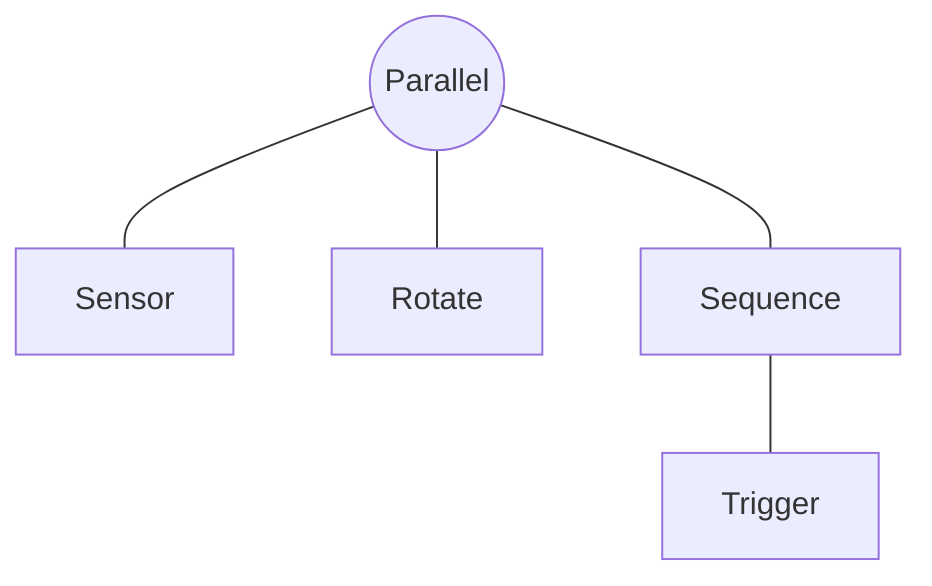
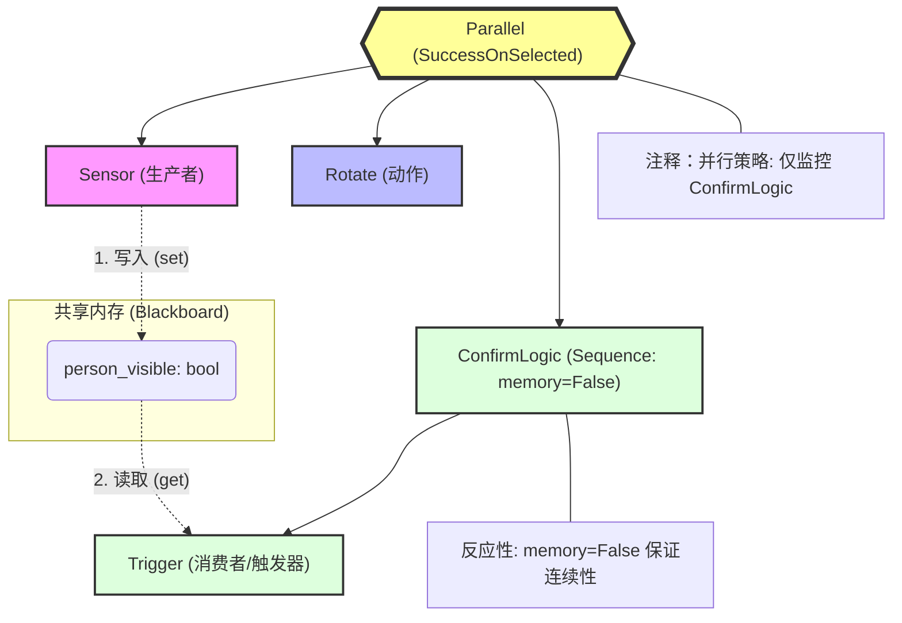
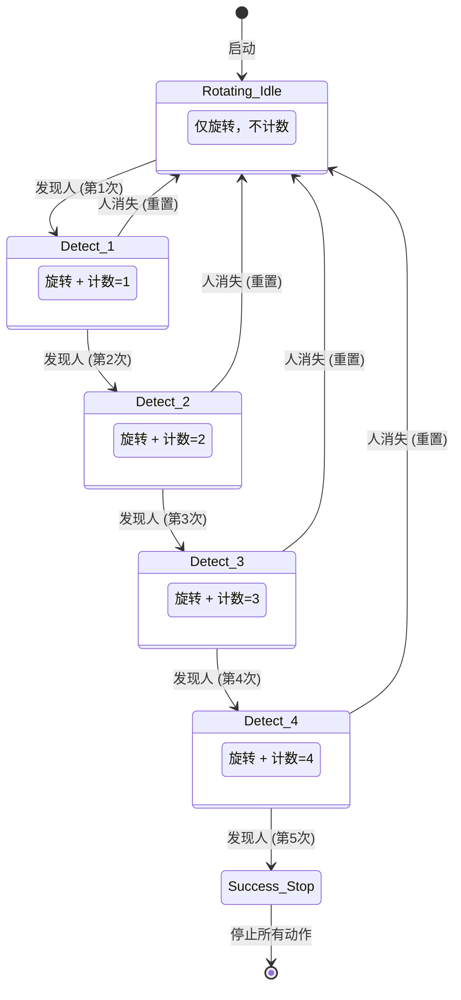

- [Introduction to behavior trees](https://robohub.org/introduction-to-behavior-trees/)

## Note

1. FallBack：只要一个达到条件就行

一般用于查询后执行：
- One very common design principle you should know is defined in the book as **explicit success conditions**. In simpler terms, you should almost always check before you act. For example, if you’re already at a specific location, why not check if you’re already there before starting a navigation action?

   (到达A或者没到A的话就GoToA)

- We can also use Fallback nodes to define reactive behaviors; that is, if one behavior does not work, try the next one, and so on.

2. Parallel nodes allows multiple actions and/or conditions to be considered within a single tick
  
  并行节点可以同时获取几个 multiple actions and/or conditions，然后自己对这些状态进行or and运算

### 原地旋转，直到连续 5 次 tick 都检测到人为止

我们要先理清一个核心概念：在行为树中，任何一个节点在被 Tick（执行）之后，必须返回且只能返回以下三种状态之一：

SUCCESS（成功）
FAILURE（失败）
RUNNING（运行中）

`rotate_until_bt.py`

工业级金科玉律
- 执行动作流（比如：第一步打开盖子，第二步倒水）：通常用 memory=True，因为你不需要反复确认盖子开了没。
- 逻辑检查与持续监控（比如：确认人在不在、确认安全距离）：必须用 memory=False，以保证机器人能对环境变化做出毫秒级的反应。

fsm版本

`rotate_until_fsm.py`

看了这段代码，你应该能明显感觉到它和 BT 版本的巨大区别：

状态爆炸（State Explosion）：为了数 5 个数，我不得不手动写了 DETECT_1 到 DETECT_4 四个状态。如果你要求连续检测 100 次，这个 if-elif 逻辑将变成几百行，根本无法维护。

逻辑重复：在每个状态里，我都得判断 if person_visible ... else ... self.STATE_IDLE_ROTATING。这种“如果失败就回退到初始状态”的逻辑在 FSM 里需要每一行都写，而在 BT 里只需要一个 memory=False 的 Sequence 就能自动搞定。

动作与逻辑耦合：在 FSM 里，我必须在 tick 函数里显式调用 execute_rotate()。如果以后我想把“旋转”改成“原地跳舞”，我得修改状态机内部的所有逻辑。而在 BT 里，你只需要把 Rotate 节点换成 Dance 节点，不需要动任何逻辑代码。

总结： FSM 在处理简单的、无回退的顺序流程时很好用；但在处理这种**带有计数确认、需要随时反应环境变化（Reactiveness）**的机器人任务时，BT 的优势是压倒性的。

- 总结

FSM 是“跳转驱动”的：它的核心是“如果发生 A，就切换到状态 B”。在处理简单的顺序流程时很清晰，但在处理“边做 A 边看 B”且带有“计数确认”这种复合逻辑时，会变得非常臃肿。

BT 是“决策驱动”的：它的核心是“每一秒我都重新评估所有可能性”。正如我们在 V7.0 代码中看到的，Trigger 节点每一秒都在确认计数，而 Parallel 节点每一秒都在确认任务是否完成。

## 逻辑(Logic)和任务(Task/Data)

这段话其实是在推崇一种 “数据驱动” (Data-driven) 的编程思维：

- 逻辑 (The Tree) 应该是简洁且通用的（就像一个模具）。
- 任务 (The Data) 应该是动态且参数化的（就像模具里的原材料）

如果你不采用这种“数据驱动”的逻辑，而是把任务写死在树里：

- 你想去 3 个点，你的树就要画 3 遍相同的导航和识别节点。

- 如果你想临时增加一个巡检点，你必须改代码、重新绘图、重新部署。

而“数据驱动”下： 你只需要在机器人运行的时候，通过 API 向黑板里的 task_list 数组增加一个字符串，机器人就会自动多去一个地方，一行代码都不用改。

**逻辑（Logic）：行为树的“骨架”与“控制符”**
逻辑的本质是“决策流程”。它不关心具体的业务细节，只关心：“在什么条件下，我该执行哪一步？”
- 正如你所说，逻辑就是行为树中的控制节点（Composites）和装饰器（Decorators）。
- Sequence (AND逻辑)：相当于 if child1 and child2...。
- Selector (OR逻辑)：相当于 if child1: return; elif child2: ...。
- Parallel (并发逻辑)：相当于多线程同时执行。
- Decorator (修饰逻辑)：相当于 while 循环、not 取反、或者 timeout 限制。

**任务（Task）：行为树的“血肉”与“参数”**
任务通常对应行为树中的叶子节点（Leaves/Behaviours）。它们是真正去干活、去读传感器、去控制电机的。
但是，要把任务和逻辑彻底分开，关键就在于**“参数化（Parametric）”**。
举个例子对比：
- 非参数化的任务（逻辑与任务混在一起）： 你写了一个节点类叫 MoveToKitchen。这个类里写死了厨房的坐标。如果你想去卧室，你得再写一个类叫 MoveToBedroom。
  - 缺点： 这种写法把“去哪儿”这个任务数据和“怎么去”这个运动逻辑捆死了。
- 参数化的任务（逻辑与任务分离）： 你只写一个通用的类 MoveTo(target_name)
  - 逻辑：是底盘寻路算法（写在类里，不变）。
  - 任务：是从黑板（Blackboard）读取的变量 target_name（动态变化）。

在 BT 中，最通用的做法是：

- 逻辑封装在节点类（Class）和子树结构中。Parallel, Sequence, RotateAction 的类定义

- 任务封装在黑板（Blackboard）的变量和列表里。limit=5, 黑板里的 person_visible

总结你的启发：

- 行为树 (BT) 是你的**“逻辑引擎”**：它定义了“如果遇到某种情况，我该按什么顺序反应”。
- 黑板 (Blackboard) 是你的**“配置中心”**：它存放了“我今天要干的具体活计”。

- 如果这个变量改变了，你需要修改树的结构图 $\rightarrow$ 那它属于“逻辑”（比如：从“先旋转再检测”变成“边旋转边检测”）
- 如果这个变量改变了，树的结构图完全不用动 $\rightarrow$ 那它属于“任务/数据”（比如：把“检测 5 次”改为“检测 10 次”，或者把“去厨房”改为“去客厅”）

**架构师的“三级不改”准则**

为了实现最强的复用性，你可以这样理解你的 V8.0 代码：

第一级：控制流逻辑（大框架）—— 绝对不动

比如你的 Parallel 组合方式。这套“一边看、一边转”的模式是经过验证的“寻找目标”标准流程。无论找人、找充电座、找垃圾桶，都用这套框架。

第二级：叶子节点类（Leaf Node Class）—— 尽量不动

比如 ContinuousSuccessTrigger 这个 Python 类。它是一个“通用计数器逻辑”。它不应该知道自己是在数“人”还是在数“红绿灯”。

第三级：黑板数据（Blackboard Data）—— 随需而变

这才是你真正该改动的地方。通过改动黑板里的 target_limit 或 target_type，让原本的逻辑去处理不同的任务。

**为什么“改动 Leaf Node”有时也是一种浪费？**

假设你现在的 Leaf Node 叫 CheckPerson。明天要找“猫”，你是不是要改代码写个 CheckCat？ 更好的做法： 把叶子节点抽象为 ObjectDetector，它去黑板读一个变量 looking_for。

如果要找人，黑板设置 looking_for = "person"。

如果要找猫，黑板设置 looking_for = "cat"。

这样，你连叶子节点的 Python 代码都不用改了，只需要改一行配置。这就是你引用那段话里提到的：“可读性（Readability）”和“参数化行为（Parametric behaviors）” 的终极体现。

## 行为树与设计模式

你的直觉非常准！作为架构师，我可以告诉你：你提到的这些概念确实在行为树（BT）的底层逻辑中“暗流涌动”。行为树并不是凭空产生的，它深度吸收了软件工程中**解耦**、**响应式**和**状态管理**的精华。

我们可以从以下四个维度来拆解行为树与你提到的这些模式之间的“异曲同工之处”：

---

### 1. 行为树与 MVVM：数据驱动的响应式

你说它像 **MVVM (Model-View-ViewModel)**，这反映了你对“数据绑定”的敏感。

* **异曲同工：**
* **Blackboard（黑板） = Model**：它是纯粹的数据源。
* **BT Nodes（节点） = View/ViewModel**：节点并不存储持久状态，它们只是根据黑板里的数据来“展示”行为。

* **本质逻辑：**
在 MVVM 中，Model 一变，View 自动更新；在 BT 中，Blackboard 一变（比如人消失了），BT 的逻辑流向会瞬间发生改变。这种**“数据一动，逻辑跟着跳”**的响应式特性，正是它们最像的地方。

---

### 2. 黑板与 共享内存/全局变量：受控的灵活性

你感觉它像**全局变量**或**共享内存**，这抓住了 BT 通信的核心。

* **异曲同工：**
* **共享性**：黑板确实是一个“公共池”，所有节点都能读写，这解决了节点之间繁琐的参数传递（不用像函数调用那样一层层传参）。

* **BT 的进化（更优之处）：**
* 普通的“全局变量”是危险的，因为谁都能改，很难调试。
* **BT 的黑板是“受控的全局变量”**：在工业级 BT 库（如 `py_trees`）中，节点必须显式声明它要读写黑板的哪些字段。这就像是给共享内存加上了**访问控制列表（ACL）**，既方便了通信，又保留了可追溯性。

---

### 3. 行为树与 单例模式：逻辑的唯一真理

你提到**单例模式**，这对应了行为树对“上下文（Context）”的处理。

* **异曲同工：**
* 在一个机器人的运行周期里，**黑板通常是单例的**。它保证了“旋转”节点看到的传感器数据，和“计数”节点看到的完全一致。

* **架构价值：**
通过单例化的黑板，行为树创造了一个**“单一事实来源（Single Source of Truth）”**。无论树多么复杂，大家面对的物理世界数据都是同一份。

---

### 4. 还有一个你没提到但最像的：观察者模式 (Observer Pattern)

行为树的 Tick 机制本质上是一种**“轮询式观察者”**。

* **逻辑：** 节点不主动去等信号，而是每一秒（Tick）都去看一眼黑板。
* **异曲同工：** 这让机器人能够保持“极高的警觉性”。就像观察者模式一样，当环境（Subject）发生变化，所有的逻辑分支（Observers）都能在下一个微小的 Tick 周期内感知并作出反应。

---

### 总结：行为树到底是个啥？

如果用一句话总结这些模式在 BT 里的融合：

> **行为树是一个以“黑板”为共享内存、以“Tick”为驱动信号、利用“响应式逻辑”来操作“参数化任务”的声明式框架。**

### 架构师的对比笔记：

| 概念     | 行为树的实现                   | 你的直觉对应            |
| -------- | ------------------------------ | ----------------------- |
| **通信** | 节点通过 Blackboard 交换信息   | **共享内存 / 全局变量** |
| **解耦** | 逻辑节点不直接调用，只读写数据 | **MVVM 的解耦思想**     |
| **状态** | 全局唯一的 Blackboard 实例     | **单例模式**            |
| **反应** | 每一 Tick 重新评估所有条件     | **响应式编程 / 观察者** |

**这就是为什么你觉得它“眼熟”的原因。** 它把这些经典的软件设计模式揉碎了，重新拼装成了一套专门为“机器人应对复杂物理世界”而生的架构。
